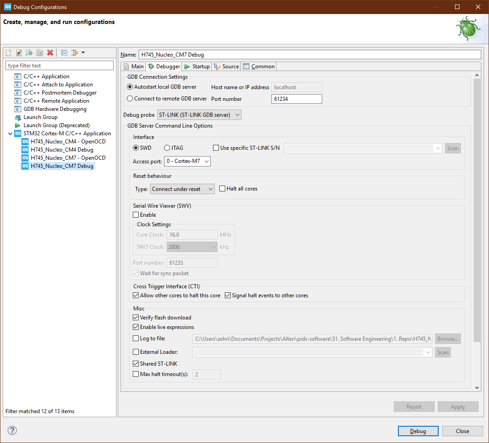

# Possible fix for H7 Dual-core debugging

## Issue: M4 core crashes when debugging
Details described [here](dual_core_debugging.md)

## Current workaround
Suggested on the [ST Forums](https://community.st.com/0D70X000007Qwhs?fromEmail=1&s1oid=00Db0000000YtG6&s1nid=0DB0X000000DYbd&s1uid=0050X000009yweL&s1ext=0&emkind=chatterCommentNotification&emtm=1582032262174&emvtk=yVXc2Ek17Ya3DVNlJFcHLafPK_WWCDCJsuQh7UFIGAk%3D)

